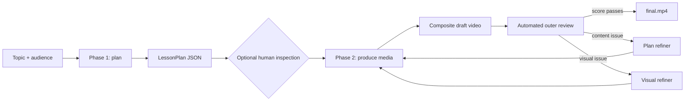
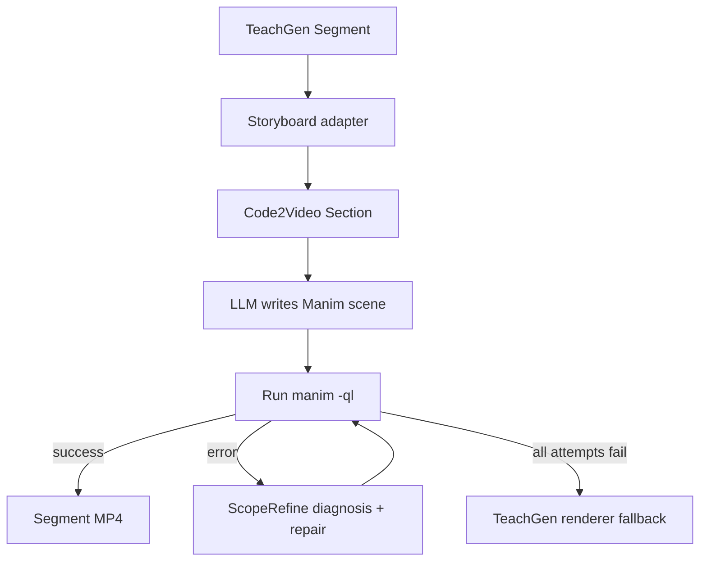

# TeachGen Codebase and Workflow Guide

> A newcomer-oriented explanation of the repository, the end-to-end teaching-video generation workflow, its agent roles, and the boundary between automated feedback and human review.

## 1. The shortest useful mental model

This repository turns **one topic plus one audience into a narrated teaching video**. Its main package, `teachgen`, owns the lesson plan and the overall workflow. It divides a lesson into segments, chooses the best visual medium for each segment, generates narration and visuals, joins them into a video, and asks a multimodal model to review the result. When the reviewer finds a meaningful problem, only the affected segment is supposed to be regenerated.

The second major directory, `code2video`, is an upstream Manim animation system. TeachGen does not use Code2Video's full, standalone workflow. Instead, it adapts Code2Video as one segment-level renderer inside the larger TeachGen pipeline.



There are two ideas to keep in mind while reading the code:

1. **The segment is the unit of work.** Narration, visual assets, review issues, and cache invalidation all use stable IDs such as `seg1` and `seg2`.
2. **Pydantic models are the handoff contracts.** Stages exchange `LessonPlan`, `Segment`, `NarrationAudio`, `VisualAsset`, and review objects rather than reaching into one another's implementation.

## 2. Repository map

| Path | Responsibility |
|---|---|
| `teachgen/cli.py` | Command-line entry point and flags. |
| `teachgen/config.py` | API key, model names, loop limits, parallelism, and run paths. |
| `teachgen/schema.py` | Pydantic data contracts shared by every stage. |
| `teachgen/pipeline.py` | The only module that knows the complete Phase 1 → Phase 2 workflow. |
| `teachgen/planner/` | Writes spoken lesson content, then assigns a renderer and visual brief to each segment. |
| `teachgen/providers/` | One interface for text, structured text, vision, TTS, transcription, and image generation. |
| `teachgen/renderers/` | Pluggable animation, concept-image, and slide production paths. |
| `teachgen/audio/` | TTS narration and word-level timing extraction. |
| `teachgen/compositor/` | Fits visuals to narration and concatenates all segments into MP4. |
| `teachgen/feedback/` | Current outer reviewer and two refiners, plus the older reviewer/router implementation. |
| `teachgen/concept_image.py` | Reused prompt-engineering helper for educational illustrations. |
| `teachgen/make_slide.py` | Reused parser and optional PPTX helper; the active video renderer draws PNGs directly. |
| `code2video/agent.py` | Upstream `TeachingVideoAgent`, used only for per-segment Manim code generation and rendering. |
| `code2video/scope_refine.py` | Diagnoses Manim failures, asks the model for scoped repairs, and validates repaired code. |
| `code2video/prompts/` | Prompts for Code2Video's standalone stages; only the Manim code-generation prompt is on the active TeachGen path. |
| `runs/<topic>/` | Generated plan, audio, visual assets, review JSON, drafts, and final video. |

The repository contains roughly 5,300 lines of Python. Most TeachGen modules are intentionally small; the largest and most complex pieces are the imported Code2Video agent and its Manim repair machinery.

## 3. Entry point and configuration

The normal command is:

```bash
export OPENAI_API_KEY=sk-...
python -m teachgen --topic "How the Fourier transform works"
```

`teachgen/__main__.py` calls `teachgen.cli.main()`. The CLI builds a `Config` with `Config.from_env(...)`, which:

- reads `OPENAI_API_KEY`;
- selects model defaults (`gpt-4o` for text and vision, `gpt-4o-mini-tts`, `whisper-1`, and `gpt-image-2`);
- converts the topic to a filesystem-safe slug;
- places the run under `runs/<topic-slug>/`;
- configures feedback, score threshold, parallel workers, and the maximum number of outer rounds.

The default provider is OpenAI. The CLI exposes `--provider gemini`, but `GeminiProvider` is currently a stub whose methods raise `NotImplementedError`; it is an architectural seam, not a usable backend today.

`pipeline.generate(cfg)` then creates one provider and calls `phase1_plan(...)` followed immediately by `phase2_produce(...)`.

## 4. The data contracts: the spine of the system

`teachgen/schema.py` is the best early read for a new contributor because it defines the vocabulary of the workflow.

| Contract | What it carries |
|---|---|
| `Segment` | Stable ID, title, spoken narration, chosen modality, visual brief, rationale, duration hint, and renderer hints. |
| `LessonPlan` | Topic, audience, objectives, and the ordered segment list. |
| `NarrationAudio` | Segment ID, MP3 path, measured duration, and optional word timings. |
| `VisualAsset` | Segment ID, `image` or `video`, file path, and optional intrinsic duration. |
| `OuterReview` | Holistic score plus pre-classified content and visual issues. |
| `ContentIssue` | A segment and either its `narration` or `visual_brief` that needs revision. |
| `VisualIssue` | A segment whose rendered output is broken or unattractive even though the planned approach is acceptable. |

The contracts matter because the pipeline can replace a renderer or provider without changing the rest of the system. They also make a targeted feedback loop possible: an issue points to `seg3`, and the pipeline can invalidate only `seg3` rather than starting over.

## 5. Phase 1: from a topic to a lesson plan

Phase 1 is text-only and has two model roles.

### 5.1 Curriculum designer: `planner/content_writer.py`

`content_writer.write_content(...)` asks the model to act as a curriculum designer. Given the topic and audience, it returns:

- three to five learning objectives;
- four to eight ordered teaching segments;
- a title and exact spoken narration for every segment.

The prompt asks for a progression such as hook → intuition → mechanism → example → recap. It explicitly forbids visual directions so that content design and visual direction remain separate responsibilities.

The response is validated into the private `TeachingContent` model. The code overwrites any model-echoed topic and audience with the caller's original values.

### 5.2 Visual director/router: `planner/route.py`

`route.plan_lesson(...)` sees all narration segments and assigns one modality to each:

- `animation` for processes, derivations, demonstrations, and changing state;
- `concept_image` for intuition, metaphors, and a single labeled diagram;
- `slide` for the final recap only.

It also writes a concrete `visual_brief`, a rationale, and an estimated duration. Routing output is zipped back onto the original narration by list position and assigned stable IDs (`seg1`, `seg2`, ...). If the model returns too few routing decisions, missing entries default to animation with the narration itself as the brief.

Finally, `_enforce_slide_only_last(...)` applies a deterministic policy after the model call:

- any non-final slide is changed to a concept image;
- the final segment is changed to a slide if necessary.

This means the prompt expresses the creative preference, while code guarantees the final-recap rule at planning time.

### 5.3 The plan artifact

The validated plan is written to:

```text
runs/<topic>/lesson_plan.json
```

The file is both a machine contract and the clearest human-readable explanation of what the system intends to produce. `--plan-only` stops here before TTS, image generation, Manim, or video compositing incur their larger costs.

## 6. Human review: what is incorporated today

The code has a **human-inspectable checkpoint**, not a complete human-in-the-loop approval system.

### What is supported

- `python -m teachgen ... --plan-only` writes and prints the plan, then stops.
- A reviewer can inspect objectives, narration, modality choices, visual briefs, rationales, and duration hints in ordinary JSON.
- Because `phase2_produce(...)` accepts a `LessonPlan` object, an edited plan can be loaded and passed into production programmatically.
- Draft videos and `review_rN.json` files remain on disk, so a person can inspect what the automated reviewer saw and compare rounds.

### What is not wired into the CLI

- A normal full run does not pause for approval between phases.
- There is no `--from-plan`, `--resume`, approve/reject prompt, web review UI, or callback.
- Running the normal command after `--plan-only` generates a new Phase 1 plan and overwrites `lesson_plan.json`; it does not automatically consume the human-edited file.
- Human comments added to review JSON are not read back by the pipeline.

Therefore, human judgment is incorporated only if the operator deliberately stops after planning and invokes Phase 2 with the reviewed plan. A minimal continuation script is:

```python
from teachgen.config import Config
from teachgen.pipeline import phase2_produce
from teachgen.providers import get_provider
from teachgen.schema import LessonPlan

cfg = Config.from_env(topic="Vectors", run_dir="runs")
cfg.ensure_dirs()
plan = LessonPlan.model_validate_json(cfg.plan_path.read_text(encoding="utf-8"))
result = phase2_produce(cfg, get_provider(cfg), plan)
print(result)
```

This is an important architectural distinction: the plan file is a good seam for human review, but an approval/resume product flow still needs to be built around it.

## 7. Phase 2: producing each segment

Phase 2 maintains two in-memory dictionaries keyed by segment ID:

```text
audio_cache[segment_id]  -> NarrationAudio
visual_cache[segment_id] -> VisualAsset
```

At the start of a round, a segment is considered dirty when its visual is absent from `visual_cache`. Dirty segments are produced in a `ThreadPoolExecutor` by default, up to `max_workers` (six by default). Each worker performs narration first and rendering second.

### 7.1 Narrator and aligner

`audio/narrator.py` sends the segment narration to the provider's TTS capability and writes `audio/<segment-id>.mp3`.

The OpenAI provider then sends the generated audio back through Whisper because the TTS API does not return timestamps. It records word-level start/end timings and treats the last word's end time as the preferred segment duration, falling back to audio-file probing when timestamps are missing.

The narration duration is the timing authority for static segments and the target used to fit animations.

### 7.2 Renderer dispatch and fallback

`_render_segment(...)` looks up the chosen renderer in a registry and gives it a `RenderContext` containing the config, provider, output directory, and narration length.

The attempt order is:

```text
planned modality -> concept_image -> slide
```

Duplicate modalities are skipped. This means a failed animation first degrades to a concept image; a slide is the emergency last resort. If a fallback succeeds, the in-memory segment modality is mutated to the fallback modality.

Planning guarantees that only the last segment is a slide, but the final emergency fallback can still produce a non-final slide if both the planned renderer and concept-image renderer fail.

## 8. The three renderer paths

### 8.1 Animation renderer: TeachGen + Code2Video + Manim

The animation route is the deepest sub-pipeline:



`renderers/animation.py` first uses a structured-output prompt to compress the narration and visual brief into two aligned lists: two to five short on-screen lecture lines and one simple 2D animation description per line.

It converts those lists into Code2Video's `Section` dataclass and creates a `TeachingVideoAgent` with a deliberately restricted `RunConfig`:

- Code2Video's own outline and whole-storyboard stages are bypassed because TeachGen already owns the outline.
- external asset download is disabled (`use_assets=False`);
- Code2Video's per-section MLLM layout-feedback loop is disabled (`use_feedback=False`);
- the inner Manim execution and repair loop remains enabled;
- whole-scene regeneration is capped at two attempts, with up to three scoped bug-fix attempts per regeneration.

The provider is wrapped in a small response-shape adapter so Code2Video's text calls still use the same OpenAI key and model interface as the rest of TeachGen.

`TeachingVideoAgent.generate_section_code(...)` asks a Manim-specialist prompt to create a scene using the supplied `TeachingScene` base class and grid-positioning rules. `render_section(...)` runs `manim -ql`, which produces roughly 854×480 at 15 fps. If Manim fails, `ScopeRefineFixer` analyzes the traceback, chooses a repair scope, asks the model to fix the relevant code, validates Python syntax, and performs dry-run checks before trying Manim again. A successful clip is copied to `runs/<topic>/assets/<segment-id>.mp4` and later upscaled by the compositor.

### 8.2 Concept-image renderer

This route has two generative steps:

1. A visual-explainer role expands the segment's brief into a detailed English image prompt with composition, labels, palette, layout, and educational style.
2. The provider's image model generates a 1536×1024 landscape PNG.

The renderer writes `assets/<segment-id>.png` and returns a normalized static `VisualAsset`. The compositor, rather than the image renderer, decides how long it remains on screen.

### 8.3 Slide renderer

The slide route combines generative copy with deterministic drawing:

1. A slide-copywriter prompt produces a title, two to five short bullets, and an optional three-node diagram description.
2. `make_slide.parse_input(...)` parses the text.
3. Pillow draws a 1920×1080 PNG using a fixed navy, moss, cream, and blue palette.

The active video path does not invoke LibreOffice or Poppler and does not need to create a PPTX. `make_slide.py` remains useful for standalone editable-slide output, but the renderer uses its parsing helpers and draws directly to PNG.

## 9. Compositing and timing

`compositor/compositor.py` pairs each visual with narration by segment ID and normalizes everything to 1920×1080.

- A static image becomes an `ImageClip` whose duration equals the narration duration.
- A short animation is extended by freezing its last frame until narration finishes.
- If an animation is longer than narration, the audio track is fitted to the visual duration; the implementation pads with trailing silence when audio is short and clips audio when needed.
- Segment clips are concatenated in lesson-plan order.
- MoviePy writes H.264 video with AAC audio, `yuv420p`, and `faststart` for broad playback compatibility.

The compositor produces `draft_r0.mp4`, `draft_r1.mp4`, and so on. The final allowed pass writes `final.mp4`; an earlier draft can also be copied to `final.mp4` when quality passes early.

Word timings are stored but are not currently used to animate cursors, captions, or keyword highlights. The compositor comments identify that as a future extension point.

## 10. The automated feedback loop in detail

The active implementation is the nested loop imported by `pipeline.py`: `outer_reviewer`, `plan_refiner`, and `visual_refiner`. `feedback/reviewer.py` and `feedback/router.py` implement an older critique/action design and are not called by the current pipeline.

### 10.1 Outer-loop sequence

For each review round, the pipeline:

1. produces all dirty segment assets;
2. composites the entire lesson into a draft;
3. samples 12 frames evenly across the draft;
4. sends those frames plus segment titles, modalities, and narration text to the vision model;
5. sends the vision model's prose notes through a second structured-output call to obtain an `OuterReview`;
6. saves that result as `review_rN.json`;
7. either finalizes or invokes one or both inner refiners.

The phrase “watches the full video” in prompts and comments is conceptual. The current OpenAI path does **not** send the MP4 or audio to the reviewer. It sends 12 silent frame samples plus the written plan. The reviewer can judge sampled legibility, visual alignment, and plan quality, but it cannot literally hear delivery, inspect every frame, or reliably observe short-lived defects between samples.

### 10.2 Review classification

The outer reviewer returns:

- `overall_score` from 0 to 10;
- `content_issues[]` for incorrect or unclear narration, narration/visual mismatch, or a bad/vague visual brief;
- `visual_issues[]` for an output that is broken, illegible, or aesthetically poor even though the intended visual approach is acceptable;
- a summary.

Only blocker and major issues are requested. The outer reviewer decides **whether** each inner loop is needed; the inner modules decide **how** to rewrite the affected field.

### 10.3 Inner Loop 1: plan refinement

`plan_refiner.refine(...)` handles content issues while freezing segment order and modality.

| Issue field | Change | Intended invalidation |
|---|---|---|
| `narration` | Rewrite two to five spoken sentences in the same teaching position. | Audio and visual, because speech and timing changed. |
| `visual_brief` | Rewrite only the instructions for the current renderer. | Visual only; narration should remain reusable. |

The function mutates the in-memory plan and returns two disjoint dirty-ID sets. The pipeline updates `lesson_plan.json` after this inner loop.

### 10.4 Inner Loop 2: visual refinement

`visual_refiner.refine(...)` handles rendering-quality issues. It leaves narration and modality untouched and rewrites only the segment's `visual_brief` to emphasize cleaner, more legible output. The pipeline removes the corresponding visual from the cache so it will be rendered again.

Both inner loops may run during the same outer round. If both target one segment, the later visual refinement sees any narration/brief changes already applied by plan refinement.

### 10.5 Cache invalidation and actual current behavior

The design intends minimum regeneration:

```text
narration changed   -> regenerate TTS + visual
brief changed       -> regenerate visual only
unaffected segment  -> reuse both assets
```

The invalidation code follows that design, but `_produce_assets(...)` currently calls `narrator.narrate(...)` unconditionally for every segment whose visual is dirty. As a result, a visual-only refinement **does re-run TTS in the current implementation**, even though the audio entry was left in `audio_cache`. Unaffected segments are reused correctly. To realize the intended optimization, the worker should reuse `audio_cache[seg.id]` when present.

### 10.6 Stopping conditions and round counting

With the default `max_outer_rounds=3`, the loop iterates over indices 0, 1, 2, and 3:

- rounds 0–2 may be reviewed and refined;
- index 3 is the forced final production/composite pass and is not reviewed.

The loop stops early when:

- feedback is disabled;
- the score is at least the configured threshold (8.0 by default);
- there are no actionable content or visual issues;
- or the final pass is reached.

The score check occurs **before** issue handling. Consequently, a review with score 8.0 and a content issue will finalize at the default threshold without applying that issue. The included `runs/matrix/review_r0.json` is an example of exactly that combination. This may be intentional (“score is authoritative”) or may be a policy bug, but contributors should know the order is real.

The forced final pass is not reviewed, so the last refinements are not independently verified before delivery.

## 11. Every agent and actor in the process

This repository does not use a formal multi-agent framework. “Agent” is best understood as a prompt-defined model role or a stateful production component. Several roles use the same underlying `gpt-4o` provider with different system prompts.

### Active generative roles

| Role | Location | Input → output | Active? |
|---|---|---|---|
| Curriculum designer | `planner/content_writer.py` | Topic + audience → objectives and spoken segments | Yes |
| Visual director/router | `planner/route.py` | Spoken segments → modality, brief, rationale, duration | Yes |
| Animation storyboard adapter | `renderers/animation.py` | One segment → aligned lecture lines and animation directions | Animation segments only |
| Manim code generator | `code2video/agent.py` + `prompts/stage3.py` | Code2Video `Section` → executable Manim scene | Animation segments only |
| ScopeRefine repair agent | `code2video/scope_refine.py` | Code + traceback → scoped corrected code | Only after Manim failure |
| Concept-image prompt engineer | `renderers/concept_image.py` + `concept_image.py` | Visual brief → detailed image prompt | Concept-image segments and fallback |
| Image generator | `OpenAIProvider.image(...)` | Detailed prompt → PNG bytes | Concept-image segments and fallback |
| Slide copywriter | `renderers/slide.py` | Brief + narration → title, bullets, optional diagram | Final recap and emergency fallback |
| Narrator | `OpenAIProvider.tts(...)` | Narration text → spoken MP3 | Every produced segment |
| Timing aligner | `OpenAIProvider.tts(...)` via Whisper | Generated MP3 → word timestamps | Every produced segment |
| Outer educational reviewer | `feedback/outer_reviewer.py` | 12 frames + written plan → prose critique | Each enabled review round |
| Review schema normalizer | `feedback/outer_reviewer.py` via `chat_json` | Prose critique → validated `OuterReview` | Each enabled review round |
| Plan refiner | `feedback/plan_refiner.py` | Content issue + current field → rewritten narration or brief | When content issues exist |
| Visual refiner | `feedback/visual_refiner.py` | Visual issue + current brief → improved brief | When visual issues exist |

### Active deterministic actors

These are not model agents, but they are equally important to the workflow:

- `pipeline.py` orchestrates state, rounds, cache invalidation, and finalization.
- the Pydantic schemas validate model handoffs and retry malformed structured output once.
- `_enforce_slide_only_last(...)` guarantees a routing policy after the model responds.
- the renderer registry dispatches modalities without coupling the pipeline to concrete classes.
- Manim and ScopeRefine's syntax/dry-run checks execute and validate generated animation code.
- the frame sampler selects review evidence.
- MoviePy/ffmpeg performs deterministic audiovisual assembly and encoding.

### Present but bypassed or disabled in TeachGen

Code2Video is a larger standalone agent system than TeachGen uses. The following roles exist in the repository but are bypassed on the active TeachGen path:

| Dormant role | Why it is not active |
|---|---|
| Code2Video outline designer (`stage1`) | TeachGen's curriculum designer owns the only lesson outline. |
| Code2Video full storyboard designer (`stage2`) | TeachGen creates a small per-segment storyboard adapter instead. |
| External asset selector/downloader | TeachGen sets `use_assets=False`. |
| Code2Video per-section MLLM layout critic (`stage4`) | TeachGen sets `use_feedback=False` and relies on its outer review loop. |
| Code2Video whole-video evaluators (`stage5_*`) | They belong to the standalone/research evaluation workflow, not `teachgen.pipeline`. |
| Code2Video video merger | TeachGen's compositor merges mixed static and animated segments. |
| Legacy TeachGen reviewer and router | `feedback/reviewer.py` and `router.py` remain for reference but are not imported by the current pipeline. |

This distinction prevents a common onboarding mistake: reading every Code2Video prompt and assuming every stage runs during `python -m teachgen`. It does not.

## 12. Provider and model-call architecture

Every generative capability is hidden behind the `Provider` protocol:

```text
chat       plain prompt -> text
chat_json  prompt + Pydantic schema -> validated object
vision     prompt + image bytes -> text
tts        narration -> MP3 bytes + word timings
image      prompt -> PNG bytes
```

`OpenAIProvider.chat_json(...)` injects the JSON Schema into the system message, uses JSON mode, validates with Pydantic, and gives the model one self-correction attempt after a validation error.

The single-provider design is what makes the project “one key.” Even Code2Video's text calls are shimmed through the TeachGen provider. It also creates a clean extension point: a fully implemented alternative provider can replace all capabilities without changing the planner or pipeline, provided it satisfies the protocol.

## 13. Outputs and state on disk

A typical run directory is:

```text
runs/<topic>/
├── lesson_plan.json
├── review_r0.json
├── review_r1.json
├── assets/
│   ├── seg1.png
│   ├── seg2.mp4
│   └── ...
├── audio/
│   ├── seg1.mp3
│   ├── seg2.mp3
│   └── ...
└── video/
    ├── draft_r0.mp4
    ├── draft_r1.mp4
    └── final.mp4
```

Code2Video also creates working files under `code2video/CASES/tg_<run-name>/...`, including generated Manim source and Manim's media tree. Those files are implementation intermediates; TeachGen copies successful segment MP4s into the run's `assets/` directory.

The caches exist only in memory for a single invocation. There is no general resume-from-existing-assets mechanism, and the pipeline does not validate that an old asset matches a newly loaded plan.

## 14. Failure handling

The system contains several layers of graceful degradation:

1. Structured text gets one validation-repair attempt.
2. Manim scenes get scoped bug fixes and whole-scene regeneration attempts.
3. A failed planned renderer falls back to concept image, then slide.
4. Static and animated timing mismatches are absorbed by the compositor.
5. A review with no targetable issues can finalize rather than loop forever.

If all renderer options fail for a segment, the final exception propagates and the run stops. Provider errors in most other stages also propagate; there is no job queue or durable retry state.

## 15. Important current-state caveats

These points are useful for both operators and future maintainers:

1. **Automated review is sampled and silent.** It evaluates 12 frames plus plan text, not full motion plus audio.
2. **Human review is a seam, not an approval workflow.** The plan is editable, but resuming requires Python code or a future CLI feature.
3. **Visual-only fixes currently regenerate narration.** Cache invalidation says “visual only,” but the production worker always calls TTS for dirty visuals.
4. **Passing score wins over listed issues.** The score threshold is checked before the issue arrays.
5. **The last refinement is not reviewed.** The final allowed pass composites and exits.
6. **Gemini is not implemented.** Selecting it reaches stubs.
7. **Fallback may change only in-memory state.** A renderer fallback mutates `seg.modality`, but the plan file is not immediately rewritten solely because of that fallback.
8. **The emergency slide fallback can violate the recap-only convention.** It happens only if earlier renderers fail.
9. **Legacy artifacts use both feedback schemas.** For example, `runs/vectors/review_r0.json` uses the old `critiques` schema, while `runs/matrix/review_r0.json` uses the current content/visual buckets.
10. **There is no automated test suite in the repository.** Changes to prompts, loop policy, caching, and media behavior currently require manual or ad hoc validation.
11. **Dependency metadata needs a small audit.** `cli.py` imports `python-dotenv`, but it is not listed in the shown TeachGen requirements file.

## 16. How to read and extend the code

For a first pass, read in this order:

1. `teachgen/schema.py` — learn the nouns.
2. `teachgen/pipeline.py` — see the lifecycle and state transitions.
3. `teachgen/planner/content_writer.py` and `planner/route.py` — understand Phase 1.
4. `teachgen/feedback/outer_reviewer.py`, `plan_refiner.py`, and `visual_refiner.py` — understand the nested loop.
5. `teachgen/renderers/` — compare the three production strategies.
6. `teachgen/audio/narrator.py` and `compositor/compositor.py` — understand timing.
7. `code2video/agent.py` and `scope_refine.py` — only then dive into animation internals.

To add a fourth visual modality:

1. add a value to `Modality`;
2. implement the `SegmentRenderer` protocol;
3. register the renderer in `renderers/__init__.py`;
4. describe the modality in the router prompt.

The compositor and feedback loop operate on normalized assets and segment IDs, so they should not need modality-specific changes.

The highest-value workflow improvements would be a real `--from-plan`/approval path, genuine reuse of cached audio on visual-only revisions, review policy that reconciles score and outstanding issues, and a final verification review. Those changes would make the implemented behavior match the architecture already suggested by the code's contracts and comments.

## 17. End-to-end summary

TeachGen is best thought of as a **segment-oriented orchestration layer around several specialist model roles and deterministic media tools**. Phase 1 separates curriculum writing from visual direction and produces a durable plan. Phase 2 generates narration and one of three visual forms for each segment, composites the results, samples the draft for automated review, and revises targeted plan fields.

The feedback architecture is thoughtfully decomposed: the outer reviewer classifies, the plan refiner repairs meaning and instructions, and the visual refiner repairs rendering guidance. Stable segment IDs and shared schemas are the core enabling ideas. The human-review story is earlier in its evolution: the JSON plan provides the right checkpoint, but the application does not yet include a complete pause/approve/resume loop.
