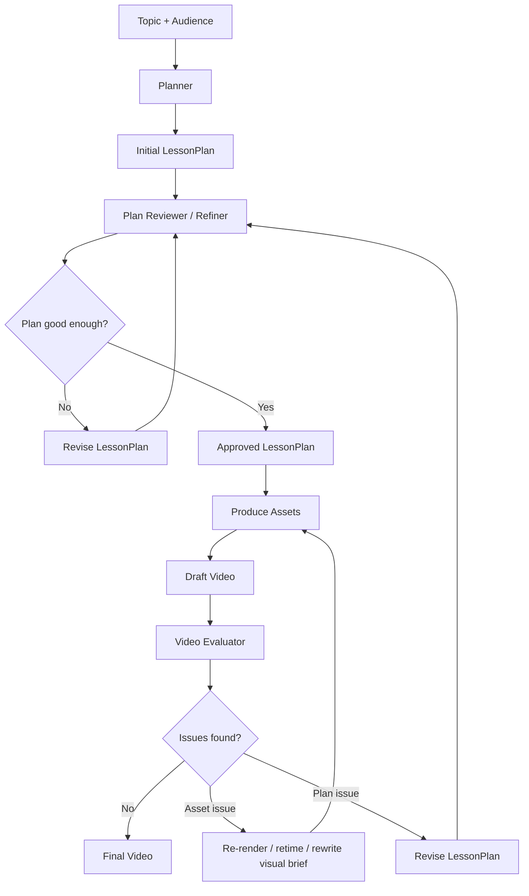

# teachgen

**One OpenRouter key + one topic → a narrated teaching video.** An orchestration layer
that unifies this repo's three production paths behind a single planner and a
single-key provider, then narrates, composites, and self-reviews the result.

```bash
export OPENROUTER_API_KEY=sk-or-...

# full run
python -m teachgen --topic "How the Fourier transform works"

# use the evaluator to drive the feedback/refinement loop
python -m teachgen --topic "How the Fourier transform works" --feedback-mode evaluator

# evaluator feedback + final evaluator report
python -m teachgen --topic "How the Fourier transform works" --feedback-mode evaluator --eval-baseline

# inspect the plan before spending money on media
python -m teachgen --topic "Vectors" --plan-only

# common options
python -m teachgen --topic "Vectors" --audience "high-school students" \
    --max-rounds 1 --no-parallel --run-dir runs
```

## Two phases

- **Phase 1 — planner (text only).** topic → teaching content (objectives +
  per-segment spoken narration) → a `LessonPlan` that routes each segment to a
  renderer. Written to `runs/<topic>/lesson_plan.json` — review/edit before Phase 2.
- **Phase 2 — produce (media).** per segment: narrate (TTS + word timings) and render
  the visual → composite → an MLLM watches the result and proposes **targeted** fixes
  → loop. Output at `runs/<topic>/video/final.mp4`.
- **Evaluator feedback mode.** `--feedback-mode evaluator` uses the evaluator during
  the refinement loop and passes adapted evaluator feedback into the existing router.
- **Optional evaluator baseline.** `--eval-baseline` runs the evaluator after the
  final video is produced and writes `runs/<topic>/evaluator_baseline/evaluation_result.json`.

```
cli → pipeline ──┬─ planner:  content_writer → route ─────────────► LessonPlan
                 └─ produce:  narrator + renderers → compositor ──► final.mp4
                                                       │
                              feedback: reviewer → router (re-render only what's broken)
                              optional: evaluator baseline report
```

Everything generative (text, structured, vision, TTS, image) goes through one
`Provider` (`providers/openrouter_provider.py`) — that is why a single key suffices.
Vision review samples frames from the mp4 before sending them to the vision model.

## Evaluator Usage

Use the evaluator for feedback/refinement:

```bash
python -m teachgen --topic "How the Fourier transform works" --feedback-mode evaluator
```

This saves:

```text
runs/<topic>/video/draft_r0.mp4
runs/<topic>/video/final.mp4
runs/<topic>/evaluator_feedback_r0/evaluation_result.json
runs/<topic>/evaluator_feedback_r1/evaluation_result.json
runs/<topic>/review_r0.json
runs/<topic>/review_r1.json
```

To also run the evaluator on the final video after refinement:

```bash
python -m teachgen --topic "How the Fourier transform works" --feedback-mode evaluator --eval-baseline
```

Final evaluator report outputs:

```text
runs/<topic>/evaluator_baseline/evaluation_result.json
runs/<topic>/evaluator_baseline/content_grades.json
runs/<topic>/evaluator_baseline/presentation_grades.json
runs/<topic>/evaluator_baseline/pedagogy_grades.json
runs/<topic>/evaluator_baseline/lecture.json
runs/<topic>/evaluator_baseline/chunks/
runs/<topic>/evaluator_baseline/chunk_analyses/
runs/<topic>/evaluator_baseline/sections/
```

## The three renderers (plugins in `renderers/`)

| Modality        | Backend (reused from this repo)        | When the planner picks it          |
|-----------------|----------------------------------------|------------------------------------|
| `animation`     | **code2video** `code2video/agent.py` (Manim) | demos, derivations, processes — the workhorse |
| `concept_image` | **concept_image.py** (`openai/gpt-image-1` through OpenRouter) | intuition, metaphor, one big idea  |
| `slide`         | **make_slide.py** parsing + PIL raster | **final recap/summary ONLY**       |

- `animation` drives code2video at **single-segment grain** (teachgen owns the
  outline, so its top-level `GENERATE_VIDEO` is bypassed). code2video's LLM calls are
  shimmed through teachgen's Provider, so the run stays single-key; its own Gemini
  video-feedback loop is disabled and teachgen's reviewer covers holistic feedback.
- `slide` rasterizes straight to PNG via Pillow (make_slide's palette + parsing),
  so **no LibreOffice/poppler** is needed.
- **Slides are reserved for the final recap.** `planner/route.py` enforces it: any
  non-final slide is demoted to a concept image, and the last segment is promoted to a
  recap slide. Renderer-failure fallback is `concept_image` (then slide) so the rule
  survives failures.

## Add a fourth path

1. Add a value to `Modality` in `schema.py`.
2. Add a `SegmentRenderer` in `renderers/` and `register()` it in `renderers/__init__.py`.
3. Add one line describing it to the planner's system prompt in `route.py`.

The pipeline, compositor, and feedback loop don't change.

## Requirements

See `requirements.txt`. Summary:
- **Python deps:** pydantic, moviepy (1.x/2.x both work via `mpcompat.py`),
  pillow, python-pptx.
- **System:** `ffmpeg` (compositing, frame sampling, audio probing).
- **For `animation` only:** Manim Community (`manim`) + its native deps, plus
  code2video's own deps in `../code2video/requirements.txt`. Without Manim, animation
  segments fall back to concept images.

## Layout

```
teachgen/
  cli.py / config.py / schema.py / pipeline.py / mpcompat.py
  make_slide.py        slide text -> (title, bullets, diagram); reused by the slide renderer
  concept_image.py     concept -> image-prompt helper; reused by the concept_image renderer
  providers/   base + openrouter_provider (default) + openai_provider (legacy) + gemini_provider (stub)
  planner/     content_writer (narration) + route (modality routing)
  renderers/   base + slide + concept_image + animation
  audio/       narrator (TTS + word timings)
  compositor/  compositor (visuals + audio -> mp4, yuv420p + faststart)
  feedback/    reviewer (MLLM watches frames) + router (targeted re-render)
```

The `animation` renderer reuses `../code2video/` (agent.py + its `prompts/` and
`json_files/`). The slide and concept_image renderers reuse `teachgen/make_slide.py`
and `teachgen/concept_image.py` (imported as package modules). Code unrelated to this
pipeline (the original TeachingMonster baseline, evaluation scripts, standalone
runners) was archived under `../__trashcan__/`.

> Security: `code2video/api_config.json` contains a real OpenAI key in git history — revoke
> it and rely on `OPENROUTER_API_KEY` for this pipeline instead.

## Full Refinement Target


